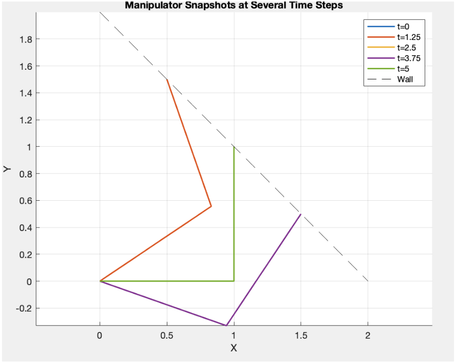
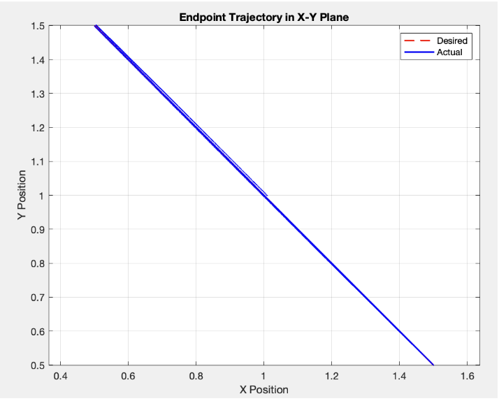
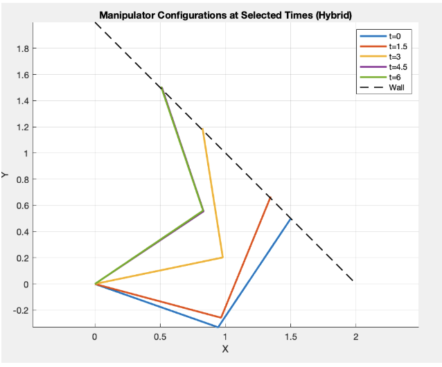
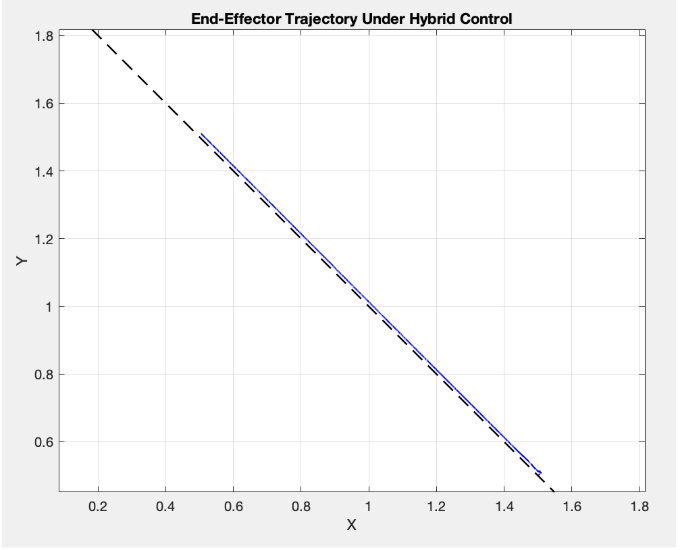
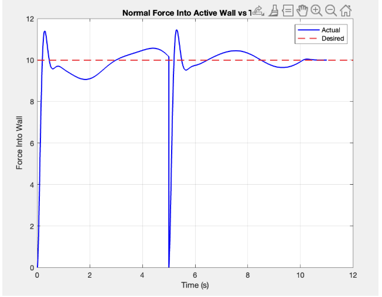

# Nonlinear Hybrid Force/Position Control of a 2-DOF RR Manipulator
---
## Overview
This project implements a full nonlinear **hybrid position/force control framework** for a planar 2-DOF RR manipulator interacting with stiff environmental constraints (walls). The controller integrates:
- nonlinear position control  
- force control  
- Tangential trajectory generation  
- Surface switching between intersecting constraint manifolds  
---

## Repository Structure

assets/ : Result figures 

robot.m : RR manipulator kinematics & dynamics

tau_controller.m : Computed-torque PID controller

visualize_robot.m : Visualization utilities

simulation.m : Nonlinear position control

simulation_B.m : Pure force control

simulation_C.m : Hybrid position/force control

simulation_D.m : Hybrid control with surface switching

---

## Simulation Modules

---

### Nonlinear Position Control  
**File:** `simulation.m`

The end-effector follows a sinusoidal trajectory along the wall line:

\[
x + y = 2
\]

oscillating between:

\[
[1.5, 0.5],[0.5, 1.5]
\]

This verifies nonlinear computed-torque tracking in free-space before introducing contact.

  
  

---

### Pure Force Control  
**File:** `simulation_B.m`

Implements force regulation normal to the wall

- Wall modeled as stiff spring (K = 1000)  
- Desired force: **10 units**  
- No tangential motion control  

Demonstrates stable force convergence during contact.

  
  

---

### Hybrid Position–Force Control  
**File:** `simulation_C.m`

Combines:

- Force regulation normal to the wall  

The manipulator slides along the wall while maintaining constant contact force.

  
  

---

### Hybrid Control with Surface Switching  
**File:** `simulation_D.m`

Adds a second intersecting wall. The robot:

- Traverses Wall 1  
- Switches constraint frames  
- Continues motion along Wall 2 while maintaining force control  

This validates full hybrid control with surface transitions.

  
  
  

